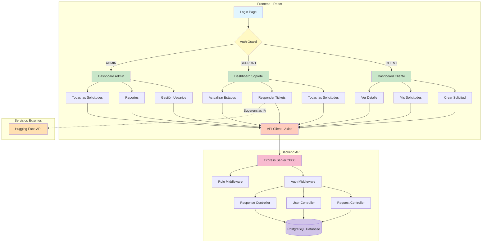
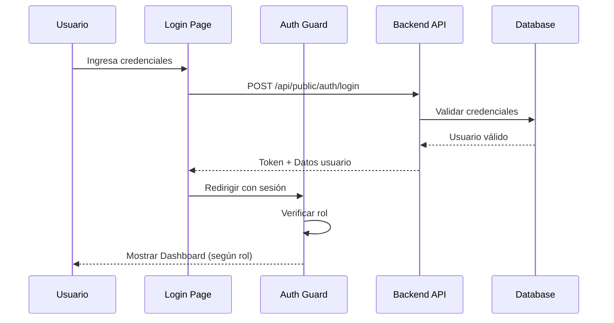
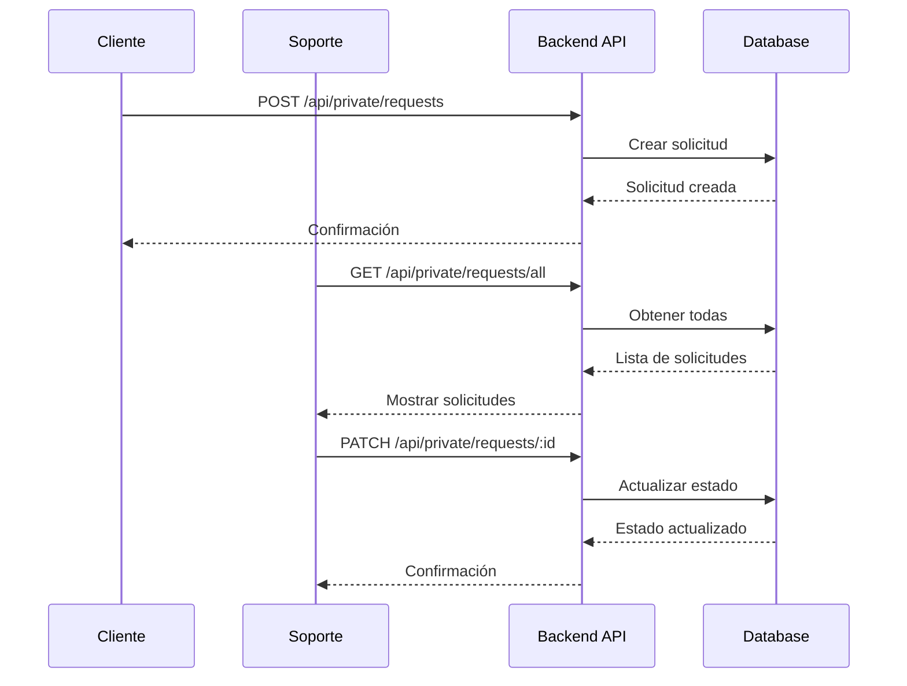
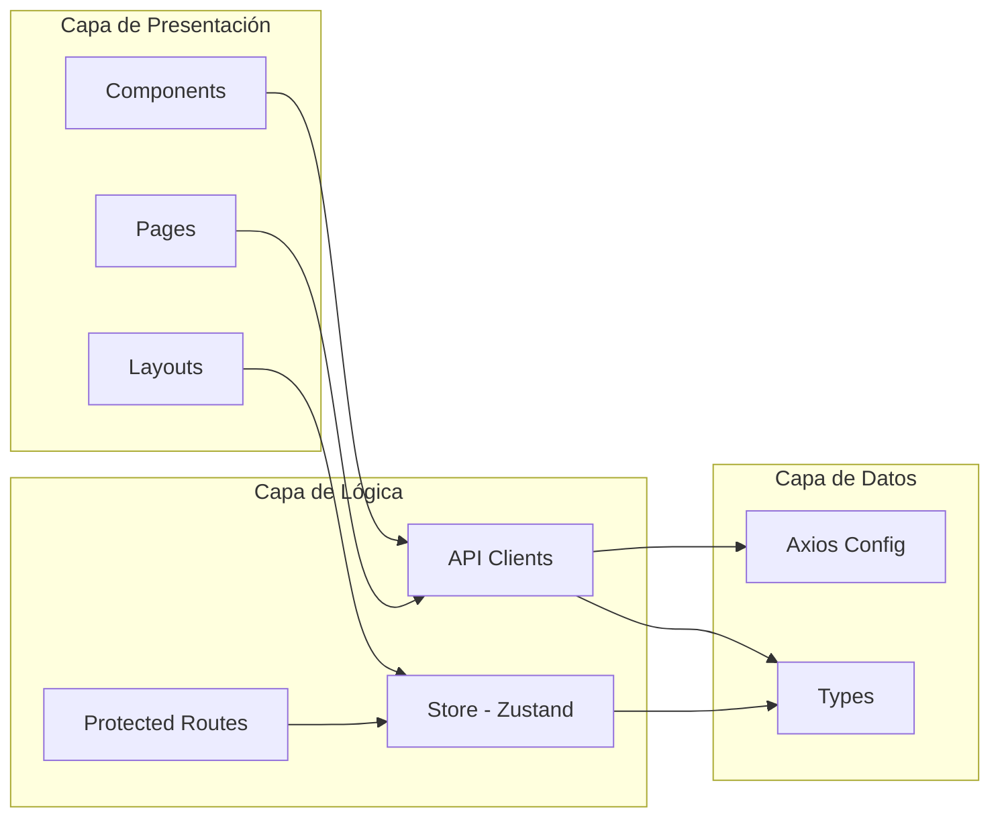

# Diagrama de Arquitectura - Sistema de Soporte

## Diagrama en Mermaid



## Diagrama de Flujo de Autenticación



## Diagrama de Flujo de Solicitudes



## Arquitectura de Componentes



---

## Para Draw.io

### Instrucciones para crear el diagrama:

1. **Abre Draw.io** (https://app.diagrams.net/)
2. **Crea un nuevo diagrama**
3. **Usa las siguientes formas:**

#### Capas Principales:

**Capa Frontend:**
```
┌─────────────────────────────────────────┐
│         FRONTEND (React + TS)           │
│                                         │
│  ┌─────────┐  ┌─────────┐  ┌─────────┐│
│  │ Cliente │  │ Soporte │  │  Admin  ││
│  │Dashboard│  │Dashboard│  │Dashboard││
│  └────┬────┘  └────┬────┘  └────┬────┘│
│       └────────────┴─────────────┘     │
│                    │                    │
│            ┌───────▼────────┐          │
│            │  Auth Guard    │          │
│            │  (Protected    │          │
│            │   Routes)      │          │
│            └───────┬────────┘          │
│                    │                    │
│            ┌───────▼────────┐          │
│            │   API Client   │          │
│            │    (Axios)     │          │
│            └───────┬────────┘          │
└────────────────────┼────────────────────┘
                     │
```

**Capa Backend:**
```
                ┌────▼─────┐
                │  REST    │
                │   API    │
                │ :3000    │
                └────┬─────┘
                     │
                ┌────▼─────┐
                │PostgreSQL│
                │ Database │
                └──────────┘
```

**Servicios Externos:**
```
┌──────────────────────────┐
│   Hugging Face API       │
│   (Sugerencias IA)       │
└──────────────────────────┘
```

#### Colores sugeridos:
- **Frontend**: Azul claro (#E3F2FD)
- **Backend**: Verde claro (#E8F5E9)
- **Database**: Morado claro (#F3E5F5)
- **Servicios Externos**: Naranja claro (#FFF3E0)
- **Conectores**: Gris (#607D8B)

#### Flechas:
- **Sólidas**: Flujo principal de datos
- **Punteadas**: Servicios opcionales (IA)
- **Bidireccionales**: Comunicación cliente-servidor

---

## Exportar desde Draw.io:

1. **File → Export as → PNG/SVG**
2. **Guardar como**: `architecture-diagram.png`
3. **Agregar al README**: 
   ```markdown
   
   ```

---

## Diagrama Simplificado (ASCII)

```
┌─────────────┐
│   USUARIO   │
└──────┬──────┘
       │
       ▼
┌─────────────────────────────┐
│    REACT FRONTEND           │
│  ┌─────────────────────┐   │
│  │  Protected Routes   │   │
│  └─────────┬───────────┘   │
│            │                │
│  ┌─────────▼───────────┐   │
│  │   Dashboards        │   │
│  │ • Cliente           │   │
│  │ • Soporte           │   │
│  │ • Admin             │   │
│  └─────────┬───────────┘   │
│            │                │
│  ┌─────────▼───────────┐   │
│  │   API Client        │   │
│  │   (Axios)           │   │
│  └─────────┬───────────┘   │
└────────────┼────────────────┘
             │ HTTP/REST
             ▼
┌─────────────────────────────┐
│    BACKEND API              │
│  ┌─────────────────────┐   │
│  │  Express Server     │   │
│  │  :3000              │   │
│  └─────────┬───────────┘   │
│            │                │
│  ┌─────────▼───────────┐   │
│  │   Controllers       │   │
│  │ • Auth              │   │
│  │ • Requests          │   │
│  │ • Users             │   │
│  └─────────┬───────────┘   │
└────────────┼────────────────┘
             │
             ▼
      ┌─────────────┐
      │ PostgreSQL  │
      │  Database   │
      └─────────────┘
```

---

## Flujo de Datos Detallado

### 1. Autenticación
```
Login Form → API /auth/login → Validate → Set Cookie → Redirect to Dashboard
```

### 2. Protección de Rutas
```
Route Access → Check Auth → Check Role → Allow/Redirect
```

### 3. Operaciones CRUD
```
User Action → Form Submit → API Call → Database → Response → UI Update
```

### 4. Actualización de Estados
```
SUPPORT/ADMIN → Select New Status → PATCH Request → Update DB → Reload Data
```
